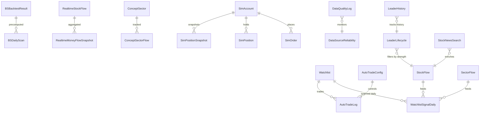

# AIROBOT 数据库 ER 图

**数据库**：PostgreSQL 16
**Schema**：public
**表数**：32
**生成时间**：2026-07-03

---

## 1. 总体 ER 图



---

## 2. 业务域分组

### 2.1 业务核心（用户直接使用）

#### Watchlist（自选股）
- 用户主动管理的股票清单
- 字段：`stock_code, stock_name, group_name, quality_status, note`
- 关系：1→N 触发 `WatchlistSignalDaily` 每日扫描

#### BSBacktestResult（BS策略回测）
- 保存的策略参数 + 回测结果
- 字段：策略名、维度、过滤器、胜率、个股胜率、盈亏因子
- 关系：1→N 触发 `BSDailyScan` 每日预扫描

#### AutoTradeConfig + AutoTradeLog（自动交易）
- `AutoTradeConfig`：单例（id=1），全平台统一配置
- `AutoTradeLog`：每日自动交易决策日志

#### SimAccount + SimPosition + SimOrder（模拟盘）
- 东财模拟盘本地缓存

---

### 2.2 数据采集层

#### StockFlow（股票日级资金流）
- 569K 行，119 MB
- 唯一约束 `(trade_date, ts_code)`
- 关键字段：`main_force_inflow, retail_flow, price_chg, price, sector`

#### RealtimeStockFlow（股票实时资金流）
- 515K 行，139 MB（分钟级快照）
- 唯一约束 `(trade_date, ts_code, snapshot_time)`
- 字段含 `confidence, sources_count, is_corrected`（多源交叉验证结果）

#### SectorFlow（板块日级资金流）
- 27K 行
- 唯一约束 `(trade_date, sector)`

#### ConceptSector / ConceptSectorFlow（概念板块）
- 概念字典 + 每日资金流

#### RealtimeMoneyFlowSnapshot（板块实时快照）
- 22K 行，按 `(dimension, block_name, snapshot_time)` 唯一

#### RealtimeConceptSectorFlow（概念板块实时）
- 2.5K 行

---

### 2.3 分析层

#### LeaderLifecycle（龙头生命周期）
- 141K 行
- 唯一约束 `(trade_date, ts_code)`
- 字段：`stage, strength, change_rate, consecutive_days`

#### LeaderHistory（龙头历史变更）
- 23 行，记录每个龙头股的进入/退出事件

#### WatchlistSignalDaily（自选股日信号）
- 780 行/天
- 唯一约束 `(trade_date, ts_code)`
- 字段：bs_signal, quality_status, change_rate, main_force_inflow, buy_power_json, market_state_json, sector_trend_json

#### BSDailyScan（BS 策略日扫描）
- 每策略每天 1 行，signals_json 存完整列表
- 唯一约束 `(trade_date, backtest_id)`

#### StockFeaturesDaily（股票特征日级）
- 384 行，市场状态判定依赖

#### StockNewsSearch（股票新闻）
- 2 行（实验性）

#### ManualReviewQueue（人工审核队列）
- 237 行

---

### 2.4 配置/日志层

#### AutoTradeConfig
- 1 行，全平台唯一
- 关键字段：`enabled, max_buy_count, min_vote_score, buy_quantity, sell_quantity`

#### BSStrategy（旧版，已被 BSBacktestResult 替代）
- 1 行

#### StrategyResult + StrategyRunLog
- 策略执行结果 + 日志

#### DataQualityLog + DataSourceReliability
- 数据源质量监控

#### AIAnalysisCache
- AI 分析缓存

---

## 3. 表清单（按行数排序）

| 表 | 行数 | 大小 | 关键索引 | 备注 |
|---|---|---|---|---|
| stock_flow | 569,426 | 119 MB | (trade_date, ts_code) UK, ts_code, trade_date | 日级资金流 |
| realtime_stock_flow | 515,737 | 139 MB | (trade_date, ts_code, snapshot_time) UK | 分钟级快照 |
| leader_lifecycle | 141,660 | 27 MB | (trade_date, ts_code) UK, ts_code, trade_date | 龙头生命周期 |
| sector_flow | 26,784 | 6 MB | (trade_date, sector) UK | 板块日级 |
| realtime_money_flow_snapshot | 22,344 | 5.7 MB | (dimension, block_name, snapshot_time) UK | 板块实时 |
| data_quality_log | 10,255 | 3.6 MB | ts | 数据质量 |
| realtime_concept_sector_flow | 2,475 | 6.7 MB | | 概念板块实时 |
| watchlist_signal_daily | 780 | 1.2 MB | (trade_date, ts_code) UK | 自选股日信号 |
| stock_features_daily | 384 | 328 KB | | 特征日级 |
| concept_sector_flow | 320 | 1.8 MB | (trade_date, concept_sector_id) UK | 概念板块日级 |
| concept_sectors | 193 | 960 KB | | 概念字典 |
| watchlist | 114 | 80 KB | stock_code UK | 自选股 |
| data_source_reliability | 101 | 96 KB | | 数据源可靠度 |
| manual_review_queue | 237 | 240 KB | | 人工审核 |
| leader_history | 23 | 88 KB | | 龙头历史 |
| stock_news_search | 2 | 152 KB | | 新闻 |
| bs_daily_scan | 3 | 1.6 MB | (trade_date, backtest_id) UK | BS 扫描 |
| strategy_result | 44 | 152 KB | | 策略结果 |
| strategy_run_log | 10 | 80 KB | | 策略日志 |
| auto_trade_log | 7 | 64 KB | trade_date, ts_code | 自动化日志 |
| bs_backtest_results | 2 | 40 KB | run_at | BS 回测 |
| sim_account | 1 | 56 KB | | 模拟盘账户 |
| sim_account_snapshot | 1 | 40 KB | | 账户快照 |
| sim_position_snapshot | 2 | 72 KB | | 持仓快照 |
| auto_trade_config | 1 | 24 KB | | 自动化配置 |
| bs_strategies | 1 | 24 KB | | 旧 BS 策略 |
| ai_analysis_cache | 0 | 24 KB | | AI 缓存 |
| sim_order | 0 | 16 KB | | 模拟盘订单 |
| sim_position | 0 | 16 KB | | 模拟盘持仓 |
| stock_daily_kline | 0 | 32 KB | | 股票日 K 线 |
| stock_data_query | 0 | 32 KB | | 数据查询 |

---

## 4. 关键字段定义

### 4.1 StockFlow

| 字段 | 类型 | 含义 |
|---|---|---|
| trade_date | date | 交易日 |
| ts_code | varchar(20) | 股票代码（如 600519.SH） |
| sector | varchar(50) | 板块名 |
| net_inflow | numeric | 净流入（元） |
| main_force_inflow | numeric | 主力净流入（元） |
| retail_flow | numeric | 散户净流入（元） |
| price_chg | numeric | 当日涨跌幅（%） |
| price | numeric | 收盘价 |
| volume_change | numeric | 量比 |
| name | varchar | 股票名（冗余字段） |

### 4.2 WatchlistSignalDaily

| 字段 | 类型 | 含义 |
|---|---|---|
| trade_date | date | 交易日 |
| ts_code | varchar | 股票代码 |
| sector | varchar(50) | 板块 |
| sector_trend_json | text | 板块趋势 JSON（含热度序列） |
| market_state_json | text | 市场状态 JSON（CHOPPY/TREND/IMPULSE） |
| bs_signal | varchar(2) | B/S/None |
| bs_reasons_json | text | BS 原因 JSON |
| quality_status | varchar(20) | 杂毛/普通/合格/优质/强势/核心/淘汰 |
| buy_power_base | text | 购买力 JSON（score/level/color/dimensions） |
| change_rate | numeric(6,2) | 涨跌幅 % |
| main_force_inflow | numeric(18,2) | 主力净流入 |

### 4.3 AutoTradeConfig

| 字段 | 类型 | 含义 | 默认 |
|---|---|---|---|
| enabled | boolean | 是否启用自动化 | false |
| max_buy_count | integer | 每日最大买入数 | 20 |
| buy_quantity | integer | 单笔买入股数 | 100 |
| sell_quantity | integer | 单笔卖出入股数 | 100 |
| min_vote_score | integer | 最小投票分 | 2 |
| max_positions | integer | 最大持仓数 | 10 |
| single_position_pct | numeric | 单股仓位 % | 10 |
| stop_loss_pct | numeric | 止损 % | 0 |
| take_profit_pct | numeric | 止盈 % | 0 |
| use_market_price | boolean | 用市价单 | true |

---

## 5. 数据保留 & 清理策略

| 表 | 保留期 | 清理频率 | 备注 |
|---|---|---|---|
| realtime_stock_flow | 30 天 | 每日 | 分钟级数据，量最大 |
| realtime_money_flow_snapshot | 30 天 | 每日 | |
| realtime_concept_sector_flow | 30 天 | 每日 | |
| sector_flow | 180 天 | 每周 | 板块历史分析 |
| concept_sector_flow | 180 天 | 每周 | |
| leader_lifecycle | 30 天 | 每日 | 龙头仅看近期 |
| stock_flow | 永久 | - | 日级数据，长期保留 |
| watchlist_signal_daily | 90 天 | 每周 | 自选股日信号 |
| data_quality_log | 30 天 | 每日 | 监控日志 |
| auto_trade_log | 365 天 | 每年 | 合规留痕 |
| sim_position_snapshot | 永久 | - | 模拟盘历史 |
| strategy_run_log | 90 天 | 每周 | |
| leader_history | 永久 | - | 长期追踪 |

---

## 6. 索引设计原则

### 6.1 已有索引（关键表）

| 表 | 索引 |
|---|---|
| stock_flow | `(trade_date, ts_code) UK` + `ts_code` + `trade_date` |
| realtime_stock_flow | `(trade_date, ts_code, snapshot_time) UK` + ts_code + trade_date + snapshot_time + ... |
| watchlist_signal_daily | `(trade_date, ts_code) UK` + trade_date + ts_code |
| leader_lifecycle | `(trade_date, ts_code) UK` + ts_code + trade_date |
| sector_flow | `(trade_date, sector) UK` + trade_date + sector |
| concept_sector_flow | `(trade_date, concept_sector_id) UK` + trade_date + concept_sector_id + (trade_date, name) |
| bs_daily_scan | `(trade_date, backtest_id) UK` + trade_date + backtest_id |

### 6.2 建议补充索引

```sql
-- 按维度查最新回测
CREATE INDEX ix_bs_backtest_dim_run ON bs_backtest_results(dimension, run_at DESC);

-- 查某账户最近订单
-- (auto_trade_log 无 account_id，先不加)

-- 查某股票历史订单
CREATE INDEX ix_auto_trade_log_ts_date ON auto_trade_log(ts_code, trade_date DESC);

-- leader_lifecycle 查某股票全部历史
CREATE INDEX ix_leader_lifecycle_ts_date ON leader_lifecycle(ts_code, trade_date DESC);
```

---

## 7. 命名规范（数据库）

| 场景 | 命名 | 示例 |
|---|---|---|
| 表名 | `snake_case` 复数 | `watchlist, stock_flow, auto_trade_logs` |
| 主键 | `id` (自增 int) | |
| 业务主键 | `<table>_<key>_key` 或 `uq_<table>_<col>` | `uq_stock_date` |
| 时间戳 | `created_at, updated_at, run_at, generated_at, trade_date` | |
| 业务日期 | `trade_date`（Date 类型）| |
| 业务时间 | `ts` / `snapshot_time`（timestamp） | |
| JSON 字段 | `<col>_json` + Text 类型 | `sector_trend_json, signals_json` |
| 冗余字段 | 明确（如 stock_flow.name 冗余自 stock_basic）| |
| 软删除 | `is_deleted` boolean | |
| 状态字段 | `<entity>_status` varchar(20) | `quality_status` |

---

## 8. 待办

- [ ] 补 `is_suspended, is_delisted, is_anomaly` 标记字段（stock_flow）
- [ ] 钳位 `win_rate > 1` 的数据
- [ ] 删除 `auto_trade_log` 2 单重复
- [ ] 清理 `sector_flow` 180天前
- [ ] 清理 `leader_lifecycle` 30天前
- [ ] 加 4 个缺失复合索引
- [ ] 编写 `migrations/` 用 Alembic 管理 schema 变更（当前手工 init_db）
