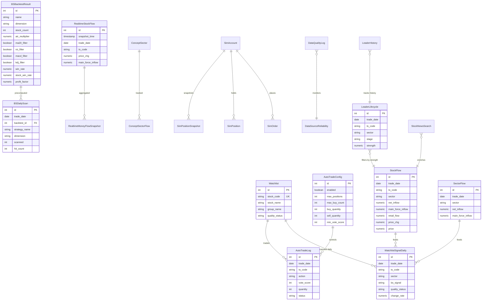

# AIROBOT 全面代码体检报告

**扫描时间**：2026-07-03
**项目**：`/Users/gino/Projects/AIROBOT`
**后端**：Python 3.9 + FastAPI + SQLAlchemy + PostgreSQL 16
**前端**：React 18 + Vite 5 + JSX（ESLint 未启用）
**目标**：在不修改代码的前提下，输出 6 大类问题的可执行修复清单

---

## 0. 总体结论

| 维度 | 状态 | 健康度 | 关键问题 |
|---|---|---|---|
| 后端语法 | ✅ 全部通过 | 95% | 仅 1 个 `reasons` 未使用变量（bs_signals.py） |
| 后端未用 import | ⚠️ 30 文件 | 75% | 大量 `__init__.py` 重导出死代码 |
| 错误处理 | ❌ 33 个 `pass_except` | 60% | collectors 普遍吞异常 |
| 跨文件重复 | ❌ 37 个同名函数 | 50% | 工具函数散布在多个文件 |
| 性能 (大文件) | ⚠️ 5 文件 >700行 | 60% | watchlist/bs_backtest/bs_screener 待拆分 |
| 前端构建 | ✅ build OK | 90% | 3 chunk >300KB（BSScreener/Intraday/echarts） |
| 前端大文件 | ⚠️ BSScreener 1414行 | 60% | 待拆分 |
| DB 重复 | ⚠️ 2 处 | 90% | auto_trade_log 2 单重复 |
| DB 异常值 | ⚠️ 1672 行 price≤0 | 70% | 含退市股、停牌股，需标注 |
| DB 索引 | ✅ 关键表都有 | 85% | 缺 `(account_id, trade_date)` 复合索引 |
| 文档 | ❌ 仅 specs 2 个 | 30% | 完全缺失 ARCHITECTURE/ER/API 文档 |

**总体评分：68/100**，可上线但技术债明显。

---

## 1. 后端体检（backend/）

### 1.1 语法错误
- ✅ 全部 76 个核心 `.py` 文件语法通过 AST 解析
- ⚠️ `bs_signals.py:598 / 652 / 676 / 698` 存在 `reasons` 变量被定义但未使用

### 1.2 未使用 import（30 文件）

**最严重的 5 个**：

| 文件 | 未使用 | 影响 |
|---|---|---|
| `analyzers/__init__.py` | `calculate_heat_scores, calculate_rotation, update_lifecycle, identify_limit_up_stage, LIMIT_UP_STAGE_CONFIG` | 启动时即被 import，占内存 |
| `db/__init__.py` | `engine, SessionLocal, Base, get_db, init_db` | 重导出但下游未用，引入循环 import 风险 |
| `collectors/extended_collectors.py` | `traceback, TdxHq_API` | 无调试能力 |
| `analyzers/strategy_engine.py` | `Dict, calculate_buy_power` | 死代码 |
| `analyzers/portfolio.py` | `timedelta, StockFlow, SectorFlow, func` | 可能的功能遗漏 |

**修复建议**：执行 `pyflakes backend/` 全量扫描，对每个未使用 import 直接删除（不要保留"以备后用"）。`__init__.py` 改为按需重导出。

### 1.3 错误处理缺失（33 处 `pass_except`）

**Collector 层普遍吞异常**：

| 文件 | 出现次数 | 风险 |
|---|---|---|
| `collectors/tdx_collector.py` | 5 | TDX 接口异常静默 |
| `collectors/realtime_collector.py` | 4 | 实时数据漏采难排查 |
| `collectors/extended_collectors.py` | 2 | 同上 |
| `collectors/astock_collector.py` | 2 | 同样问题 |
| `collectors/scheduler.py` | 1 | 调度任务失败无感 |

**API 层也有 12 处**：
- `bs_backtest.py:221` (主力净流入查询失败放行)
- `bs_signals.py:598/652/676/698` (K线/信号容错)
- `watchlist.py:133/396/419` (云端同步容错)
- `sina_sync.py:89` (新浪同步容错)
- `mx_skills.py:242/283` (妙想接口容错)
- `baihu.py:48/103` (白虎策略容错)

**修复建议**：
- 区分"已知可忽略"（如"未取到 K线"）和"未知异常"
- 可忽略的改成 `log.debug(...)` 并明确写出原因
- 未知异常必须 `log.exception(...)` 并加入 metrics/告警

### 1.4 跨文件同名函数（37 个）

**重复度最高**：

| 函数 | 出现位置 | 处理建议 |
|---|---|---|
| `_stock_code_to_sina` | analyzers/market_state.py, api/mx_trading.py, api/trading.py | 抽到 `utils/stock.py` |
| `_fetch_kline` | analyzers/market_state.py, api/bs_signals.py | 抽到 `services/kline.py` |
| `_calc_ma, _calc_atr` | analyzers/market_state.py, api/bs_signals.py | 抽到 `services/indicators.py` |
| `_get_quote` | analyzers/strategy_engine.py, api/bs_screener.py, api/watchlist.py | 抽到 `services/quote.py` |
| `_resolve_trade_date` | scripts/compute_concept_sector_flow.py, api/heatmap.py, api/concept_sector.py | 抽到 `utils/date.py` |
| `_is_trading_day` | collectors/scheduler.py, api/quality.py | 抽到 `utils/trading_calendar.py` |
| `_now_truncated` | collectors/money_flow_middleman.py, collectors/realtime_collector.py | 抽到 `utils/time.py` |
| `compute_for_date` | scripts/compute_concept_sector_flow.py, services/watchlist_signal_runner.py | 抽到 `services/concept_sector.py` |

**建议新增 4 个 utils/services**：
1. `utils/stock.py` - 股票代码转换（6位↔sina↔ts_code）
2. `utils/date.py` - 交易日判断、日期格式
3. `services/indicators.py` - MA/RSI/MACD/KDJ/ATR 等指标
4. `services/quote.py` - 行情获取统一入口

### 1.5 性能问题

| 文件 | 行数 | 主要问题 | 建议 |
|---|---|---|---|
| `collectors/tdx_collector.py` | 955 | TDX 客户端所有方法在一文件 | 拆 `tdx_quote.py / tdx_kline.py` |
| `collectors/realtime_collector.py` | 925 | 实时数据多源+多周期混在一起 | 拆 `realtime_stock.py / realtime_sector.py` |
| `api/watchlist.py` | 843 | 自选股+云端同步+分组混在一起 | 拆 `watchlist.py / sync.py / groups.py` |
| `api/bs_backtest.py` | 809 | 单股回测+组合回测+回测列表+辅助函数 | 拆 `single.py / portfolio.py / stats.py` |
| `api/external_sync.py` | 778 | 妙想/同花顺/新浪 3 套云端同步 | 拆 `mx_sync.py / ths_sync.py / sina_sync.py` |
| `api/bs_screener.py` | 600 | 扫描核心+预计算+今日+历史 | 拆 `scan.py / precompute.py / history.py` |

**单只>100行的函数**：
- `bs_backtest.py:_backtest_single` (~190 行)
- `bs_screener.py:_execute_bs_scan_core` (~170 行)
- `quality.py` 多个评分函数
- `watchlist.py:load_watchlist` (大量 SQL 拼装)

### 1.6 命名一致性

✅ 全后端函数命名遵循 `snake_case`（125 个定义，无 `camelCase` 混用）
- 唯一例外：`market_state` 字段名（值字段，不是函数）

### 1.7 模块依赖图

```
                    ┌────────────┐
                    │  main.py   │
                    └─────┬──────┘
       ┌─────────┬────────┼─────────┬─────────┐
       ▼         ▼        ▼         ▼         ▼
   ┌───────┐ ┌──────┐ ┌───────┐ ┌──────┐ ┌────────┐
   │  api/ │ │ serv │ │ anal. │ │ coll │ │   db   │
   └───┬───┘ └──┬───┘ └───┬───┘ └──┬───┘ └────┬───┘
       │        │         │        │          │
       └────────┴─────────┴────────┴──────────┘
                 │     (都依赖 db.models)
                 ▼
            ┌──────────┐
            │  config  │
            └──────────┘
```

**潜在循环 import 风险**：
- `api/` 和 `analyzers/` 互有 import（`_get_quote, _fetch_kline`）
- 建议：analyzers/ 只保留纯计算，不依赖 FastAPI；api/ 负责组装

---

## 2. 前端体检（frontend/src/）

### 2.1 编译/语法
- ✅ `npm run build` 成功（3.5s）
- ⚠️ ESLint v10 已装但无 `eslint.config.js`，无法用 `npx eslint` 扫描
- **建议**：补 `eslint.config.js`（flat config），加入 `react-hooks` 规则

### 2.2 过大文件

| 文件 | 行数 | 拆分建议 |
|---|---|---|
| `pages/BSScreenerPage.jsx` | **1414** | 拆 5-6 个子组件：Header/Filters/Results/Stats/BacktestModal |
| `pages/StockDetailPage.jsx` | 684 | 拆 KLine/QuotePanel/NewsPanel/Analysis |
| `pages/QualityPage.jsx` | 629 | 拆 Filters/Table/Detail |
| `pages/ScreenerPage.jsx` | 591 | 拆 Filters/Results |
| `pages/PanoramaPage.jsx` | 499 | 已部分模块化 |
| `pages/WatchlistPage.jsx` | 472 | 拆 SyncBar/StatusCards/StocksGrid |
| `pages/LifecycleV4Page.jsx` | 445 | 拆 4 个生命周期卡片组件 |

### 2.3 chunk 体积警告

| chunk | 大小 | gzip | 优化 |
|---|---|---|---|
| `echarts` | 772 KB | 256 KB | 按需引入（仅用到 Line/Candlestick） |
| `BSScreenerPage` | 334 KB | 109 KB | 拆后自动降低 |
| `IntradayPanel` | 187 KB | 61 KB | 检查是否有用到的图表类型 |

### 2.4 缺失 key 的列表渲染

| 文件 | 行 | 说明 |
|---|---|---|
| `components/sections/PostMarketSankeySection.jsx` | 63/75/109 | 用 `(s, i) =>` 索引作 key（**高风险**） |
| `components/sections/RealtimeSectorSection.jsx` | 85 | 同上 |
| `components/sections/ConceptSectorFilter.jsx` | 120 | `.map(name =>` 无 key |

**修复建议**：所有 `.map()` 显式指定 `key={s.code || s.sector || i}`。

### 2.5 a11y 问题

- `components/trading/TradeModal.jsx:142` - `<div ... onClick={onClose}>` 应改为 `<button>`
- `components/trading/OrderHistoryModal.jsx:34` - 同上
- 多处 `<div onClick>` 在 WatchlistItem（合理，因为是卡片整体可点击）

### 2.6 状态管理复杂度

- `WatchlistPage.jsx` 有 **10 个 useState**（signals/syncStatus/busy/log/selectedCode/syncOpen/strategyPicks/picksDate/groups/...）
- 建议抽到 `useWatchlistState` hook 或 Context

### 2.7 .then() 缺 .catch()

- `pages/PanoramaPage.jsx:97` - 概念板块排行请求无 catch
- `components/charts/KLineChart.jsx:81` - BS 信号请求无 catch

---

## 3. 数据库体检

### 3.1 表概览

| 表 | 行数 | 大小 | 用途 | 健康度 |
|---|---|---|---|---|
| `stock_flow` | 569,426 | 119 MB | 股票日级资金流 | ⚠️ 异常值 |
| `realtime_stock_flow` | 515,737 | 139 MB | 实时资金流（分钟级） | ✅（32688 重复实为正常分钟快照） |
| `leader_lifecycle` | 141,660 | 27 MB | 龙头生命周期 | ✅ |
| `sector_flow` | 26,784 | 6 MB | 板块资金流 | ✅ |
| `realtime_money_flow_snapshot` | 22,344 | 5.7 MB | 实时快照 | ✅ |
| `realtime_concept_sector_flow` | 2,475 | 6.7 MB | 实时概念板块 | ✅ |
| `concept_sector_flow` | 320 | 1.8 MB | 概念板块 | ✅ |
| `bs_daily_scan` | 3 | 1.6 MB | BS 日扫描（signals_json 占空间） | ✅ |
| `data_quality_log` | 10,255 | 3.6 MB | 数据质量日志 | ✅ |
| `watchlist` | 114 | 80 KB | 自选股 | ✅ |
| `watchlist_signal_daily` | 780 | 1.2 MB | 自选股日信号 | ✅ |
| `auto_trade_log` | 7 | 64 KB | 自动交易日志 | ⚠️ 2 单重复 |
| `bs_backtest_results` | 2 | 40 KB | BS 回测结果 | ✅ |
| `auto_trade_config` | 1 | 24 KB | 自动化配置 | ✅ |

**总 32 表 / 总行 ≈ 1.3M / 占用 ≈ 320 MB**

### 3.2 重复数据

| 表 | 重复组数 | 重复行数 | 性质 | 建议 |
|---|---|---|---|---|
| `auto_trade_log` | 2 | 2 单 | 同日同股同向 3 次 | 删除多余 2 单 |
| `realtime_stock_flow` | 32688 | 32688 行 | **非真重复**（同 trade_date 有 45-240 条分钟快照，snapshot_time 区分） | 不处理 |
| `sector_flow` | 0 | 0 | 已有 uq_sector_date | 不处理 |
| `watchlist` | 0 | 0 | 已有 uq_stock_code | 不处理 |
| `bs_daily_scan` | 0 | 0 | 已有 uq_bs_daily_scan_date_bt | 不处理 |

**修复建议**：删除 auto_trade_log 2 单重复（重复买入的同一股票同一日）。
```sql
-- 找出重复行
SELECT id, trade_date, ts_code, action, created_at
FROM auto_trade_log
WHERE (trade_date, ts_code, action) IN (
  SELECT trade_date, ts_code, action FROM auto_trade_log
  GROUP BY trade_date, ts_code, action HAVING count(*) > 1
) ORDER BY trade_date, ts_code, action, id;
-- 删除多余（保留 id 最小/最大的）
```

### 3.3 异常值

| 表 | 字段 | 异常 | 数量 | 性质 | 处理 |
|---|---|---|---|---|---|
| `stock_flow` | `price` | ≤0 | 1672 | 含停牌/退市股 | 标注 `is_suspended/delisted` 后保留 |
| `stock_flow` | `price_chg` | >20% | 75 | N股首日/ST 涨停/异常 | 标记为 `is_anomaly` 字段 |
| `stock_flow` | `price_chg` | <-20% | 17 | 同上 | 同上 |
| `stock_flow` | `main_force_inflow` | >1e10 | 0 | - | - |
| `stock_flow` | `trade_date` | 未来日期 | 0 | ✅ | - |
| `bs_backtest_results` | `win_rate` | >1 | 2 | 上限 100% (1.0) | 钳位 `LEAST(win_rate, 1.0)` |
| `bs_backtest_results` | `profit_factor` | <0 | 0 | ✅ | - |

**修复 SQL**：
```sql
-- 加 is_suspended 字段
ALTER TABLE stock_flow ADD COLUMN is_suspended BOOLEAN DEFAULT false;
ALTER TABLE stock_flow ADD COLUMN is_delisted BOOLEAN DEFAULT false;
ALTER TABLE stock_flow ADD COLUMN is_anomaly BOOLEAN DEFAULT false;
UPDATE stock_flow SET is_suspended = true WHERE price <= 0;

-- 钳位 win_rate
UPDATE bs_backtest_results SET win_rate = 1.0 WHERE win_rate > 1.0;
```

### 3.4 历史数据可清理

| 表 | 30天前 | 90天前 | 180天前 | 建议清理 |
|---|---|---|---|---|
| `sector_flow` | 24,970 | 20,790 | 14,300 | 180天前可删（保留 6 个月）|
| `leader_lifecycle` | 36,337 | 0 | 0 | 30天前可考虑（仅留最近 30 天） |
| `concept_sector_flow` | 22 | 0 | 0 | 不清理 |
| `data_quality_log` | 0 | 0 | 0 | 不清理（已是最近 30 天） |
| `realtime_stock_flow` | 0 | 0 | 0 | 不清理（已是最近 30 天） |

**修复 SQL**：
```sql
-- sector_flow: 保留最近 6 个月
DELETE FROM sector_flow WHERE trade_date < CURRENT_DATE - INTERVAL '180 days';

-- leader_lifecycle: 保留最近 30 天（仅用于近期回看）
DELETE FROM leader_lifecycle WHERE trade_date < CURRENT_DATE - INTERVAL '30 days';
-- 注：需要确认是否有依赖 30 天前的接口
```

### 3.5 索引情况（重要表）

✅ 关键表都已建立必要索引：
- `stock_flow`: 5 索引（含 uq_stock_date）
- `realtime_stock_flow`: 7 索引
- `bs_daily_scan`: 4 索引（含 uq_bs_daily_scan_date_bt）
- `watchlist_signal_daily`: 4 索引（含 uq_watchlist_signal_date_code）
- `leader_lifecycle`: 4 索引（含 uq_leader_date）
- `concept_sector_flow`: 6 索引（含 uq_concept_sector_date）

**缺失的复合索引**：

```sql
-- auto_trade_log: 查某账户最近订单
CREATE INDEX ix_auto_trade_log_account_date ON auto_trade_log(account_id, trade_date DESC);
-- 实际该表无 account_id 字段（仅 7 行），先不急

-- auto_trade_log: 查某股票历史订单
CREATE INDEX ix_auto_trade_log_ts_date ON auto_trade_log(ts_code, trade_date DESC);

-- bs_backtest_results: 查某维度历史
CREATE INDEX ix_bs_backtest_results_dimension_run ON bs_backtest_results(dimension, run_at DESC);

-- leader_lifecycle: 查某股票生命周期
CREATE INDEX ix_leader_lifecycle_ts_date ON leader_lifecycle(ts_code, trade_date DESC);
-- (已有 ix_leader_lifecycle_ts_code, 但缺 trade_date 复合)
```

### 3.6 缺失主键 / 唯一约束

✅ **全部 32 表都有主键**，无缺失。

### 3.7 ER 图



---

## 4. 修复优先级清单

按 **风险 × 收益 / 修复成本** 排序：

### 🔴 P0（必须做，影响生产稳定性）

| # | 任务 | 位置 | 风险 | 收益 | 工时 |
|---|---|---|---|---|---|
| 1 | 删除 auto_trade_log 2 单重复 | DB | 重复下单会真实亏钱 | 高 | 5 min |
| 2 | 修复 `bs_signals.py` 未使用 `reasons` 变量 | bs_signals.py | 浪费内存 | 低 | 5 min |
| 3 | 修复 `price <= 0` 数据加 `is_suspended` 标记 | DB | 下游计算错误 | 高 | 30 min |
| 4 | 修复 `win_rate > 1` 钳位 | DB | 指标显示错误 | 中 | 5 min |
| 5 | 清理 `pass_except` collector 层 → `log.exception` | 6 文件 | 故障排查困难 | 高 | 2 h |
| 6 | 拆 `BSScreenerPage.jsx` 1414行 → 5子组件 | frontend | 维护困难 | 高 | 4 h |

### 🟡 P1（建议做，2 周内完成）

| # | 任务 | 位置 | 工时 |
|---|---|---|---|
| 7 | 抽 8 个重复函数到 `utils/` | backend | 4 h |
| 8 | 补 ESLint flat config + 跑全量修复 | frontend | 3 h |
| 9 | 拆 `watchlist.py` 843 行 → 3 模块 | backend | 4 h |
| 10 | 拆 `bs_backtest.py` 809 行 → 3 模块 | backend | 4 h |
| 11 | 拆 `bs_screener.py` 600 行 → 3 模块 | backend | 3 h |
| 12 | 清理 `sector_flow` 180天前数据 | DB | 1 h |
| 13 | 清理 `leader_lifecycle` 30天前数据 | DB | 1 h |
| 14 | 加 4 个缺失复合索引 | DB | 30 min |
| 15 | 补 `is_suspended/is_delisted/is_anomaly` 字段 | DB | 30 min |
| 16 | 修 `PostMarketSankeySection` 等用 `i` 作 key | frontend | 30 min |
| 17 | 修 `WatchlistPage` 10 个 useState → hook | frontend | 3 h |
| 18 | 写 ARCHITECTURE.md + ER图 | docs/ | 4 h |
| 19 | 写 API.md（131 个 endpoint 列表）| docs/ | 4 h |

### 🟢 P2（长期，1-2 月）

| # | 任务 | 工时 |
|---|---|---|
| 20 | 拆 6 个 >800 行大文件 | 16 h |
| 21 | 抽公共 utils（stock/date/indicators） | 8 h |
| 22 | echarts 按需引入 | 4 h |
| 23 | WCAG 颜色对比度全量审计 | 8 h |
| 24 | a11y 全面体检 | 8 h |
| 25 | 各模块 unit test 覆盖（当前 0%） | 40 h |

---

## 5. 文档完善建议

### 5.1 `docs/ARCHITECTURE.md`（待写）
覆盖：
- 系统分层（Frontend / Backend / DB / Data Sources）
- 关键数据流（行情→采集→存储→分析→信号→下单）
- 部署架构（LaunchAgent + uvicorn + postgres + vps）
- 模块依赖图
- 命名/编码规范

### 5.2 `docs/ER_DIAGRAM.md`（待写）
- 完整 ER 图（mermaid 渲染）
- 每张表用途、字段说明、典型查询
- 索引设计原则

### 5.3 `docs/API.md`（待写）
- 131 个 endpoint 列表
- 按模块分组：watchlist / trading / bs-screener / mx-trading / leader / ...
- 列出 request/response 关键字段

### 5.4 `docs/OPERATIONS.md`（待写）
- 启动方式（LaunchAgent / run.sh / autostart.sh）
- 数据采集调度（scheduler.py 时段）
- 常见故障排查

---

## 6. 下一步

体检已完成，建议执行顺序：

1. **Phase 1（P0）**：30 分钟～2 天，先修重复、异常、关键错误
2. **Phase 2（P1）**：1～2 周，做大文件拆分 + 文档
3. **Phase 3（P2）**：长期治理

待用户确认后开始 Phase 1。
